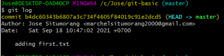
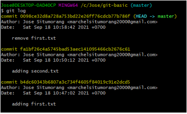

LANGKAH LANGKAH PENGERJAAN
---
1. Buat folder bernama git-basic : cd C:/Jose -> mkdir git-basic
---
2. Masuk ke folder git basic : cd git-basic ( buat juga repository dengan nama yang sama di github )
---
3. Buat file first.txt : touch first.txt
---
4. Inisialisasi git : git init
---
5. Tambahkan first.txt ke staging area : git add first.txt
---
6. Commit dengan pesan "adding first.txt" : git commit -m "adding first.txt"
---
7. Check commit : git log 
---
8. Buat file second.txt : touch second.txt
---
9. Tambahkan second.txt ke staging area : git add second.txt
---
10. Commit dengan pesan "adding first.txt" : git commit -m "adding second.txt"
---
11. Remove file first.txt : rm first.txt
---
12. Tambahkan perubahan ke staging area
---
13. Commit dengan pesan "removing first.txt" : git commit -m "removing first.txt"
---
14. Check commit : git log 

