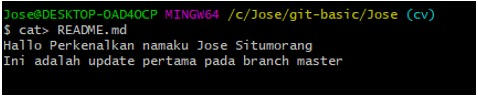
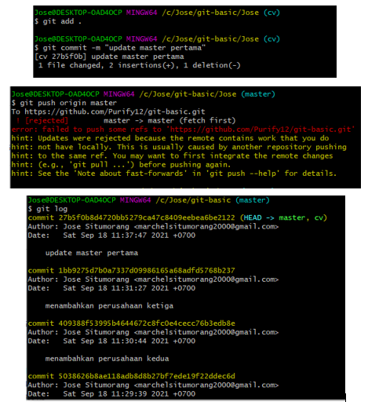
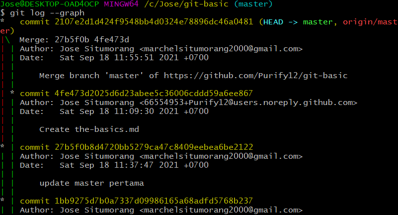

LANGKAH PENGERJAAN
---
1. Buat folder bernama Jose lalu masuk ke dalam file : mkdir Jose, kemudian :cd Jose
---
2. Buat file README.md lalu isi filenya : touch README.md , kemudian nano README.md -> ketik "Hallo Perkenalkan namaku Jose Situmorang"  
---
3. Inisialisasi git kemudian dokumentasikan: git init (karena folder dibuat dalam git basic sebelumnya ke repositori No1 tidak perlu inisialisasi kembali) > git add README.md -> git commit "Inisialisasi Git Repository" 
4. Buat branch baru : git branch cv 
---
5. Pindah ke branch baru : git checkout cv
---
6. Buat file cv.txt dan isi file : touch cv.txt -> nano cv.txt -> isi "Ini adalah file CV" 
---
7. Lakukan dokumentasi : git add cv.txt -> git commit -m "Inisialisasi CV"
---
8. Lakukan dokumentasi tiap perusahaan yang ditambah ke file cv.txt sebanyak tiga kali : 
---
9. Ubah file README.md kemudian dokumentasikan :Dokumentasi : git add README.md -> git commit -m "update master pertama"
---
10. Gabungkan branch cv ke branch master : git checkput master -> git merge cv
---
11. Unggah repository ke github : git fetch origin master -> git pull origin master -> git push origin master
---
Git log --graph : 
---

